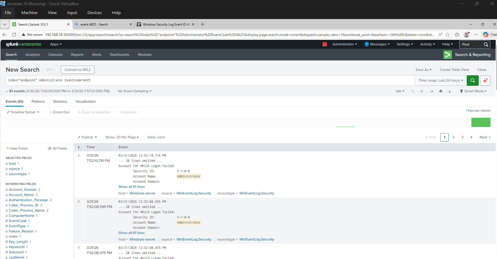
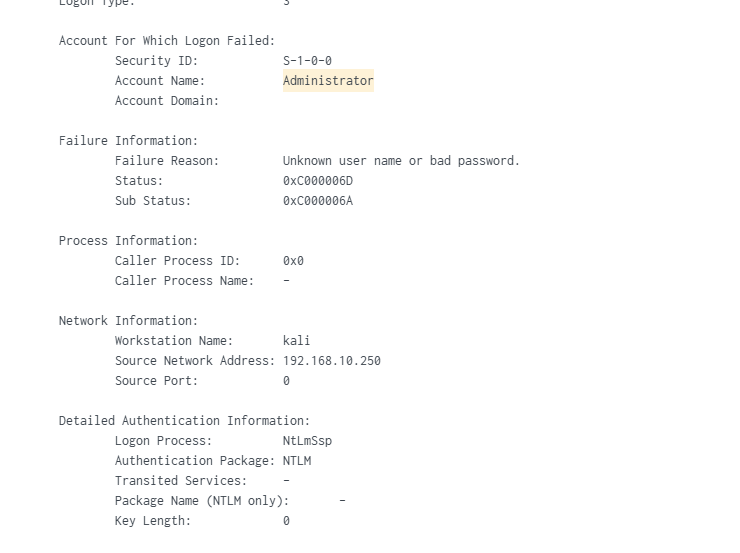

# 🔐 AD Splunk SOC Lab

## 🚀 Project Highlights
- Built a full SOC lab using Active Directory & Splunk  
- Simulated RDP brute-force attack using Kali Linux  
- Detected attacks using Event ID 4625  
- Used Atomic Red Team for MITRE ATT&CK simulation  

---

## 📌 Overview
This project demonstrates a complete Security Operations Center (SOC) lab built using VirtualBox. It includes Active Directory setup, centralized logging with Splunk, attack simulation, and real-time detection.

---

## 🛠️ Tools & Technologies
- VirtualBox  
- Windows Server 2022  
- Windows 10  
- Ubuntu Server  
- Kali Linux  
- Splunk Enterprise  
- Splunk Universal Forwarder  
- Sysmon  
- Atomic Red Team  

---

## 🗺️ Architecture
- Network: **192.168.10.0/24**  
- Domain: **bhuvan.local**

---

# ⚙️ Setup Guide (Click to Open)
 
- 👉[Network Configuration](setup/network-configuration.md)
- 👉[Splunk Installation](setup/splunk-installation.md)
- 👉[Windows 10 (Target machine)](setup/windows-target-setup.md)
- 👉[Active Directory](setup/ad-server-setup.md)
---

# ⚔️ Attack Simulation (Click to Open)

- 👉 [Attack Simulation](attack-simulation/attack.md)

---

# 📄 Documentation (Click to Open)

- 👉[Report](docs/full-report.md)

---

## 🎯 Key Outcomes
- Built a complete SOC lab environment  
- Simulated real-world cyber attacks  
- Detected threats using Splunk SIEM  
- Mapped attacks with MITRE ATT&CK  
- Gained hands-on SOC analyst experience  

---

## 📸 Sample Detection

👉 Failed login detection (Event ID 4625)

---

---

## 👨‍💻 Author
**Bhuvan K P**

---

## 📢 Conclusion
This project demonstrates practical SOC operations including attack simulation, log monitoring, and threat detection using industry tools.