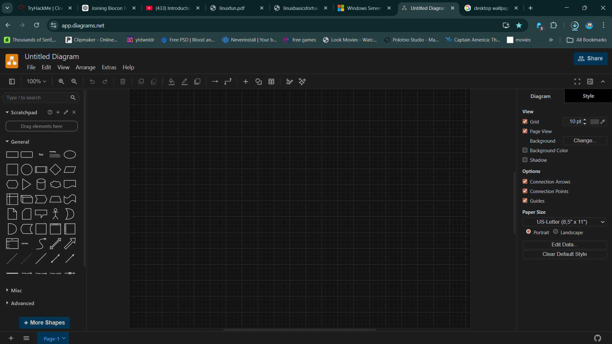
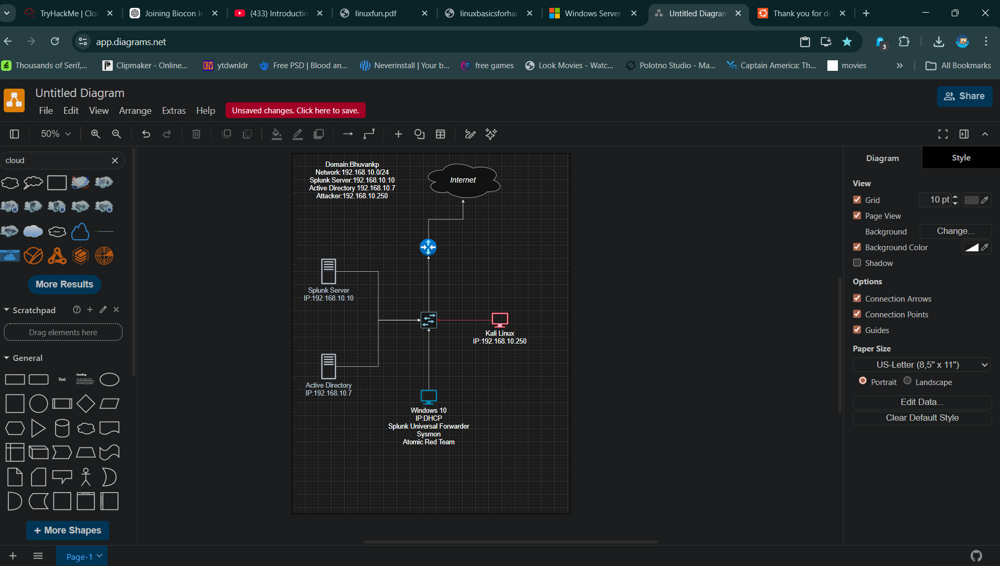

# Assets

## Overview
This folder contains supporting resources used in the project, such as architecture diagrams and visual representations of the lab environment.

---

## Architecture Diagram
- Created using **draw.io**
- Represents the complete lab setup including:
  - Windows Server 2022 (Domain Controller)
  - Windows 10 (Target Machine)
  - Ubuntu Server (Splunk Server)
  - Kali Linux (Attacker Machine)
- Shows network topology using **NAT Network (192.168.10.0/24)**

---

## Purpose of Assets
- Helps visualize the overall infrastructure  
- Makes the project easier to understand  
- Useful for documentation and presentations  

---

## Notes
- All diagrams are created for educational purposes  
- Can be modified or extended for advanced lab setups  