# ⚔️ Attack Simulation & Log Analysis

## 📌 Overview
This section demonstrates enabling Remote Desktop Protocol (RDP), performing brute-force attack simulation using Kali Linux, and detecting suspicious activities in Splunk.

---

## 🖥️ Enable RDP on Windows Machines

### Step 1: Login as Domain User
- Logged into Windows 10 using **Active Directory user credentials**

---

### Step 2: Enable Remote Desktop
- Opened:
  - **Settings → System → Remote Desktop**
- Enabled **Remote Desktop**

---

### Step 3: Add User for RDP Access
- Opened:
  - **Advanced System Settings**
- Navigated to **Remote tab**
- Clicked **Select Users**
- Added domain user for RDP access  

---

### Step 4: Authentication (ACL Prompt)
- When prompted, entered **Administrator credentials** to allow changes  

---

### Step 5: Verify RDP Port
- Default RDP port enabled:
  - **3389**

---

## Kali Linux Setup

### Step 6: Configure Static IP (GUI Method)
- Opened network settings from top panel  
- Edited **Wired Connection**  
- Set:
  - Manual IP configuration  
  - Assigned IP within **192.168.10.0/24** network  

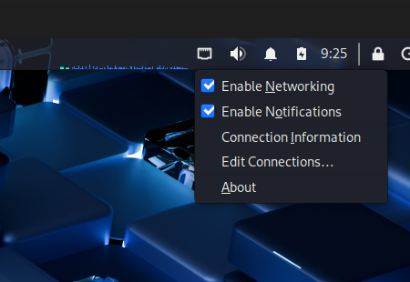
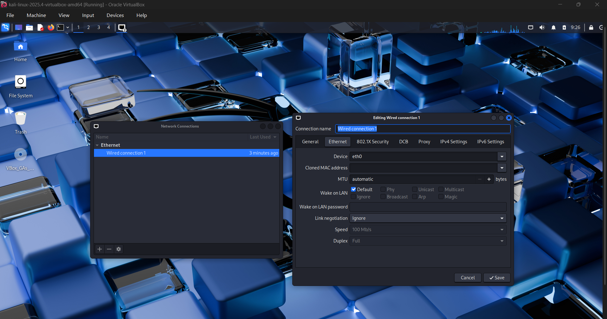
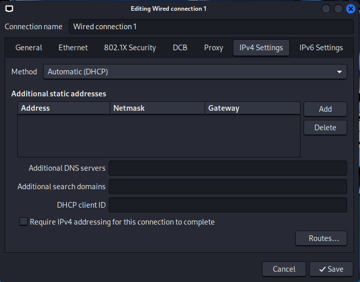
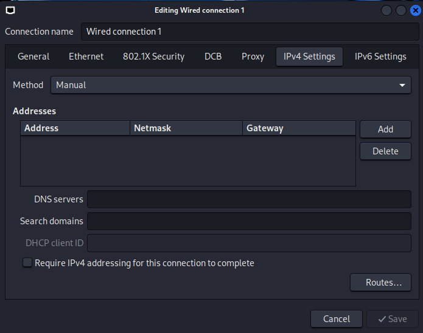
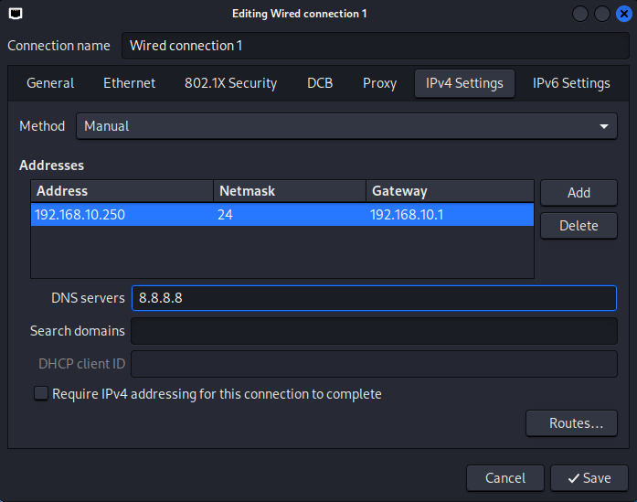
### ip changed successfully
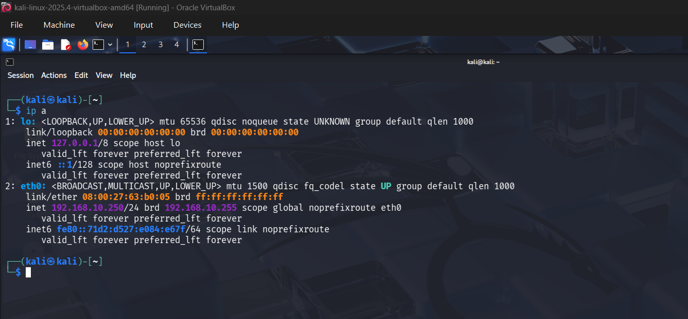
---

## 🛠️ Brute Force Tools Setup

### Step 7: Install Crowbar
```bash
sudo apt update
sudo apt install crowbar
```
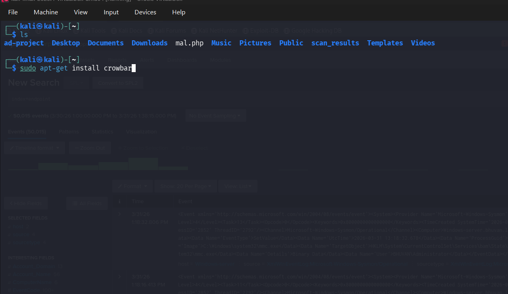
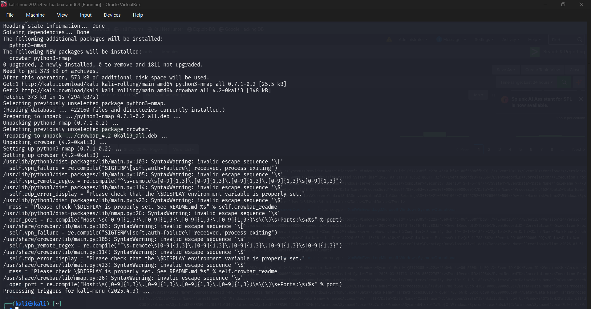
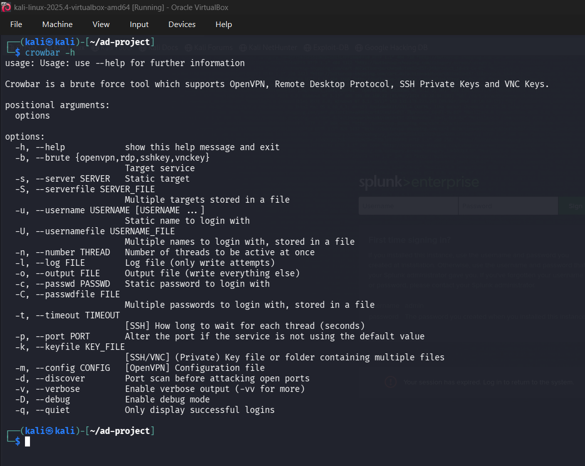
### Step 8: Prepare Password List
Extracted rockyou wordlist:
```bash
gunzip /usr/share/wordlists/rockyou.txt.gz
```
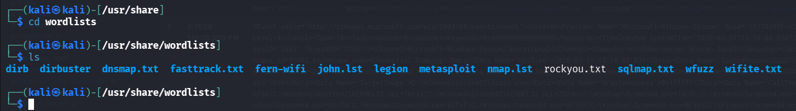
Copied to project directory:
```bash
cp /usr/share/wordlists/rockyou.txt ~/ad-project/
cd ~/ad-project
```
Reduced list size for testing:
```bash
head -n 20 rockyou.txt > password.txt
```
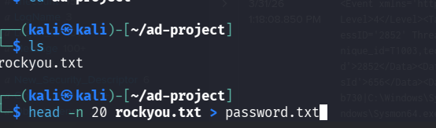
Manually added known passwords (used in AD users) to simulate successful brute force

### Step 9: Crowbar Attack Attempt
```bash
crowbar -b rdp -C /home/kali/password.txt -s 192.168.10.100
```
In my case crowbar not worked properly so
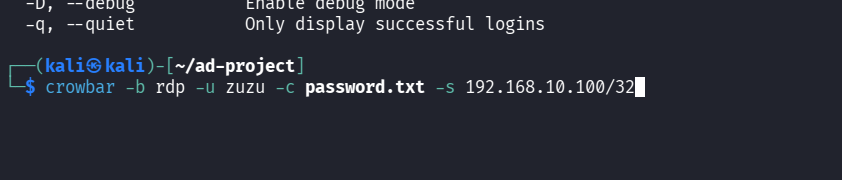

### Step 10: Alternative Tool (Hydra)
Since Crowbar did not produce results, used Hydra for brute-force attack
```bash
hydra -l zuzu -P /home/kali/ad-project/password.txt rdp://192.158.10.100
```
Successfully simulated login attempts on RDP service
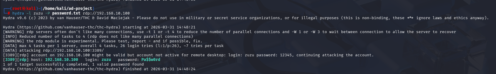
on admin
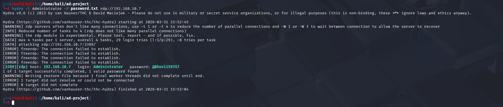
## Log Analysis in Splunk

### Step 11: Search Logs
Opened Splunk Web Interface
Navigated to Search & Reporting
Used query:

```bash
index=endpoint
```
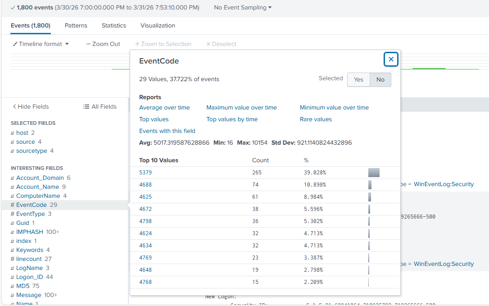
### Step 12: Filter Failed Logins
Narrowed results using filter:

```bash
index=endpoint EventCode=4625
```
### Step 13: Analysis
Identified Event ID 4625:
Failed login attempts
Observed:
Multiple failed login events
Source (attacker) IP address
Verified meaning:
"An account failed to log on" (ID 4625)


### Step 14: PowerShell Execution Policy
Allowed script execution for configuration
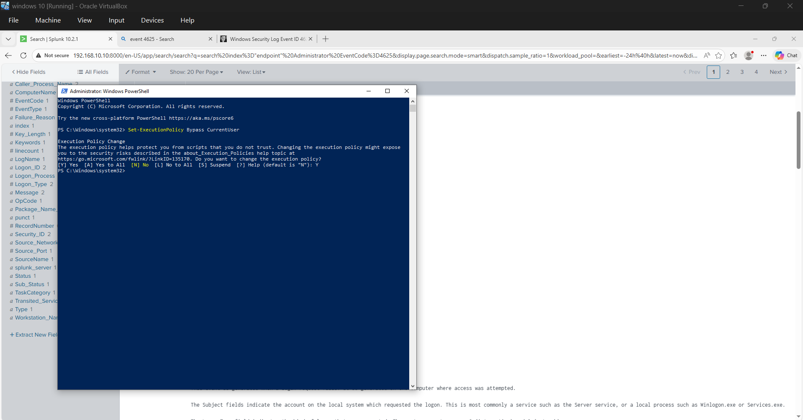

### Step 15: Windows Security Exclusion
Opened Windows Security
Added exclusion:
*C:* directory
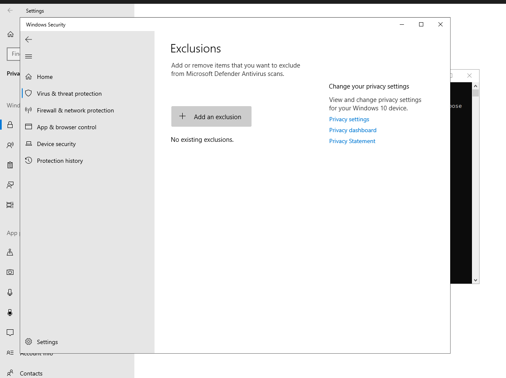
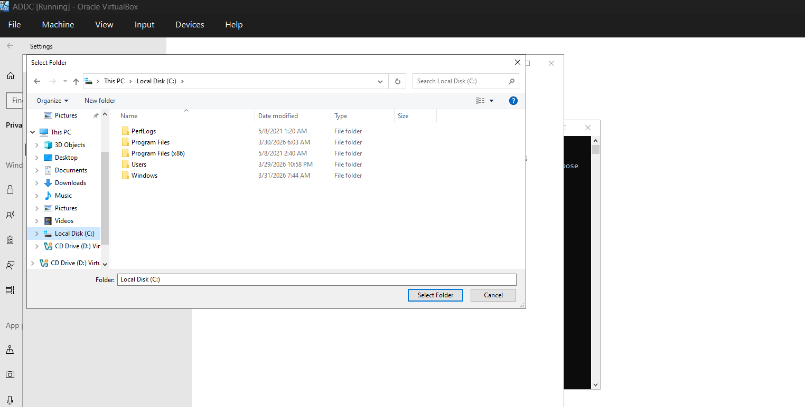
## Now Installing Atomic red team
## ⚙️ Atomic Red Team Installation

### Open PowerShell as Administrator


---

### Download Atomic Red Team
- Used official GitHub repository:

https://github.com/redcanaryco/atomic-red-team

- Cloned the repository:

```powershell
git clone https://github.com/redcanaryco/atomic-red-team.git
```


### Navigate to Directory
```bash
cd atomic-red-team
```

Inside the directory, located folders:
Txxxx (MITRE Technique IDs)

### MITRE ATT&CK Mapping
Visited:
https://attack.mitre.org/
Searched for technique IDs (e.g., T1059, T1003)
Understood:
Attack technique behavior
Detection methods
Real-world usage

## Attack Simulation

### Step 4: Run Atomic Tests
Used PowerShell to execute atomic tests:
```bash 
Invoke-AtomicTest T1059 -TestNumbers 1
```
```bash
Invoke-AtomicTest T1003 -TestNumbers 1
```


## Detection in Splunk
Search Logs
Opened Splunk → Search & Reporting
Used query:

```bash
index=endpoint
```
Filter Attack Logs
Narrowed down logs using keywords observed during attack:
```bash
index=endpoint NewLocalUser
```

OR
```bash
index=endpoint PID
```


## Analysis
Detected logs generated by Atomic Red Team tests
Observed:
NewLocalUser execution events
Suspicious command activity
Technique-based log patterns
Correlated logs with MITRE ATT&CK techniques
🧪 Tests Performed
Executed 2 Atomic Red Team tests
Verified detection in Splunk for both scenarios

Can observe PID is Spoofed
## Outcome
Successfully simulated brute-force attack on RDP
Captured and analyzed failed login attempts in Splunk
Identified attacker IP and login patterns
Demonstrated real-world detection scenario using SIEM