# 🖥️ Windows Server 2022 Setup & Active Directory Configuration

## 📌 Overview
This section describes the installation and configuration of Windows Server 2022, integration with Splunk, and deployment of Active Directory Domain Services (AD DS).

---

## 💻 Windows Server 2022 Installation
- Downloaded Windows Server 2022 ISO from the official website  
- Created and installed the server in VirtualBox  
- Renamed the system to: **ADDC**  

---

## 🌐 Network Configuration
- Configured **static IP address**:
  - IP Address: **192.168.10.7**
  - Subnet: **192.168.10.0/24**
- Ensured proper communication within the NAT network  

---

## 📦 Splunk Universal Forwarder Setup
- Downloaded and installed **Splunk Universal Forwarder**  
- Followed the same configuration steps as Windows 10:
  - Configured indexer IP: **192.168.10.10**
  - Port: **9997**
  - Configured `inputs.conf` ([link](../configs/splunkconf.md))
  - Set service to **Local System Account**
  - Restarted Splunk Forwarder service  

---

## 📊 Log Verification
- Verified in Splunk Web:
  - Both systems visible:
    - Windows 10 (Target Machine)
    - Windows Server 2022 (ADDC)

---

## 🏢 Active Directory Installation

### Step 1: Add Roles and Features
- Opened **Server Manager Dashboard**  
- Clicked **Add Roles and Features**  
- Selected:
  - **Role-based or feature-based installation**  
- Selected the server  
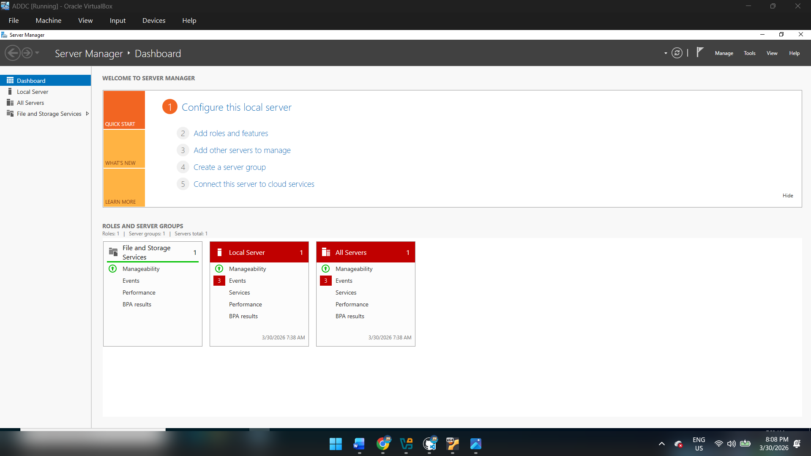
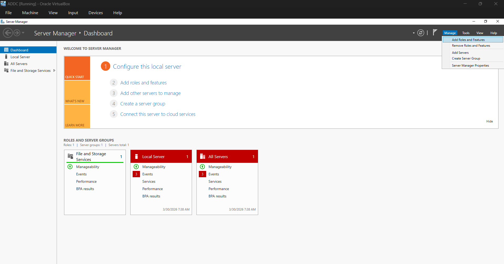
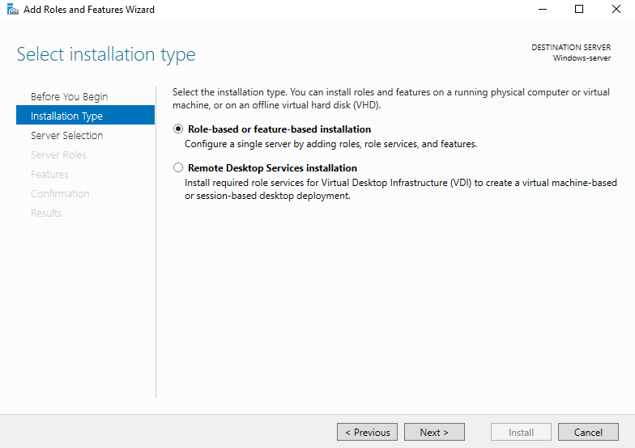
---

### Step 2: Install AD DS Role
- Checked **Active Directory Domain Services (AD DS)**  
- Clicked **Add Features**  
- Proceeded with installation  
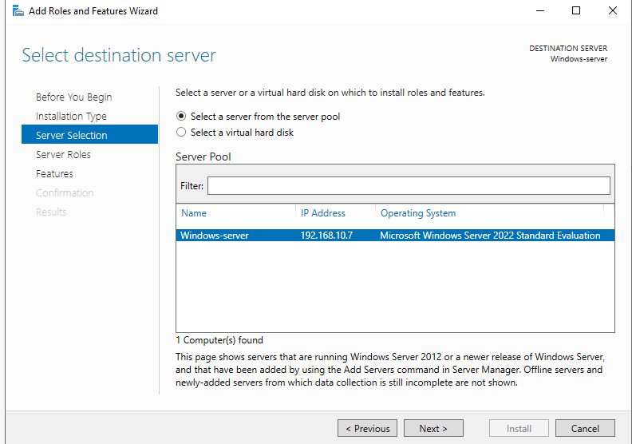

---

### Step 3: Promote to Domain Controller
- Clicked **Promote this server to a domain controller**  
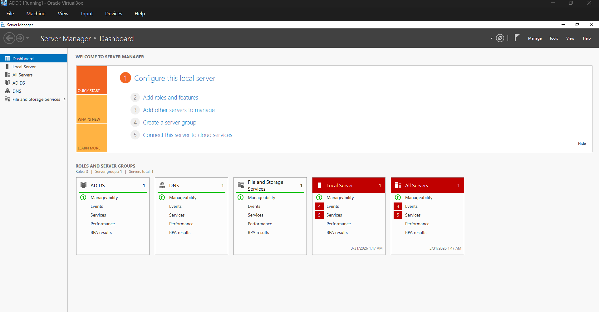
---

### Step 4: Deployment Configuration
- Selected:
  - **Add a new forest**  
- Root domain name:
  - **bhuvan.local**
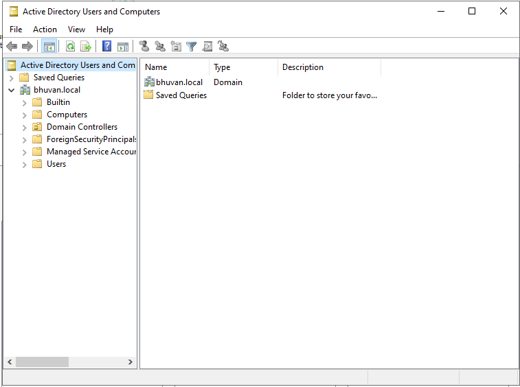
---

### Step 5: Domain Controller Options
- Set **Directory Services Restore Mode (DSRM) password**  
- Continued with default settings  

---

### Step 6: Installation
- Completed installation  
- System automatically restarted  

---

## 👥 Active Directory User Management

### Step 7: Open AD Users and Computers
- Navigated to:
  - **Active Directory Users and Computers**
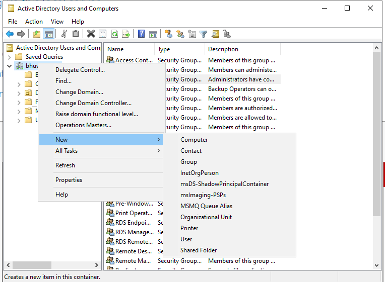
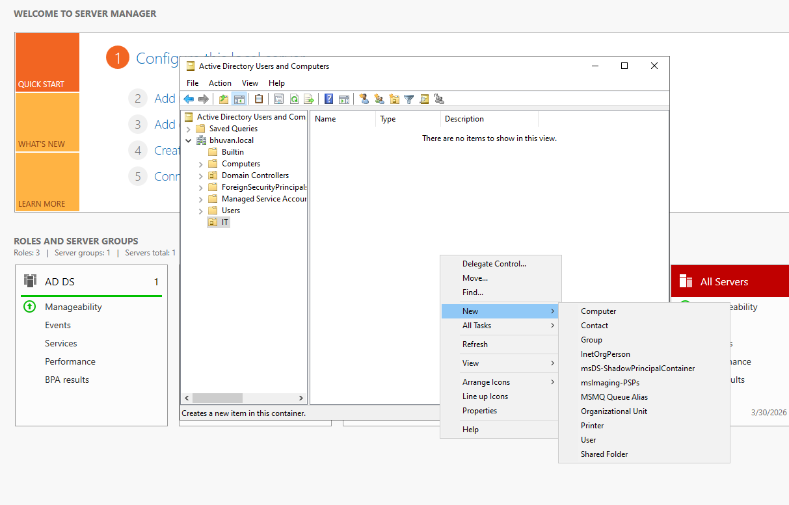
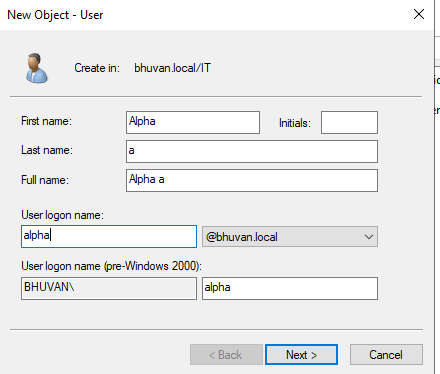
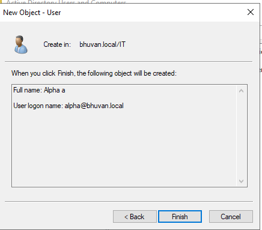
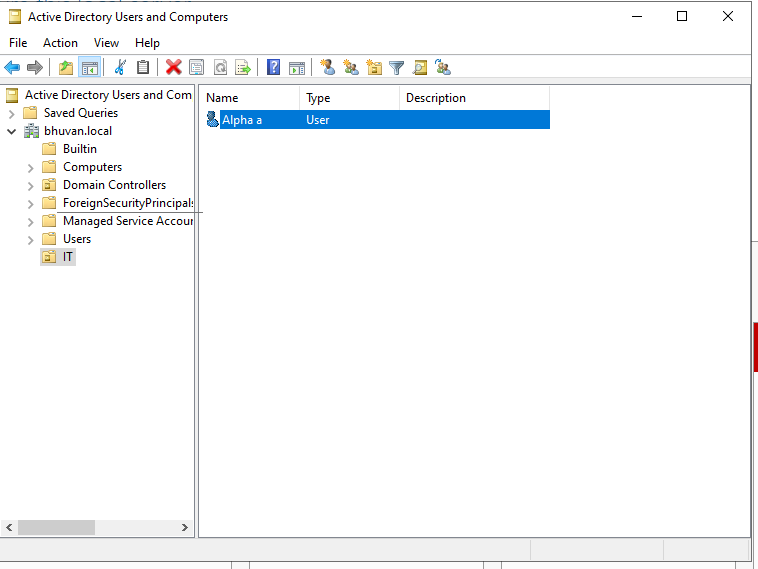

---

### Step 8: Create Organizational Units (OU)

- Created new OU:
  - **IT**

- Added user inside IT OU  

---

### Step 9: Create Another OU

- Created new OU:
  - **HR**

- Added user inside HR OU  

---

## 🔐 Outcome
- Successfully configured Active Directory domain: **bhuvan.local**  
- Created Organizational Units and users  
- Integrated domain controller logs with Splunk  

---

## 📸 Documentation
- Captured all configuration steps with screenshots for reporting  