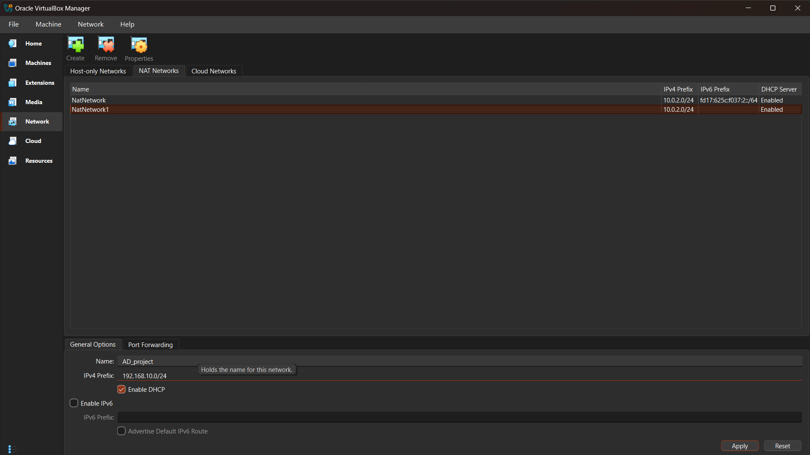

# 🌐 Network Configuration (VirtualBox)

## 📌 Overview
Configured a virtual network in VirtualBox to connect all machines in the SOC lab environment using a custom NAT Network.

---

## 🛠️ NAT Network Setup
- Created NAT Network:
  - **Name:** AD-Project  
  - **Network:** 192.168.10.0/24  
- Enabled DHCP for initial setup  

---

## 💻 Connected Machines
- Windows Server 2022 (Domain Controller)  
- Windows 10 (Target Machine)  
- Ubuntu Server (Splunk Server)  
- Kali Linux (Attacker Machine)  

---

## ⚙️ IP Configuration
- Initially used DHCP  
- Later configured **Static IPs** for all machines  

### Example:
- Domain Controller → 192.168.10.7  
- Splunk Server → 192.168.10.10  
- Target Machine → 192.168.10.100
- Kali Linux → 192.168.10.250

- Manually set:
  - IP Address  
  - Gateway  
  - DNS  

---

## 🧾 Netplan Configuration (Ubuntu)
```bash
sudo nano /etc/netplan/00-installer-config.yaml
```


```bash
sudo netplan apply
check ping <ip>
```
Verified communication between all machines

## Outcome
Stable internal network created
Enabled communication for AD, Splunk, and attack simulation
