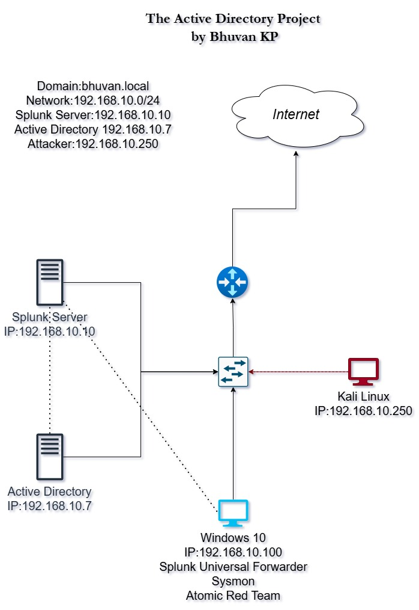
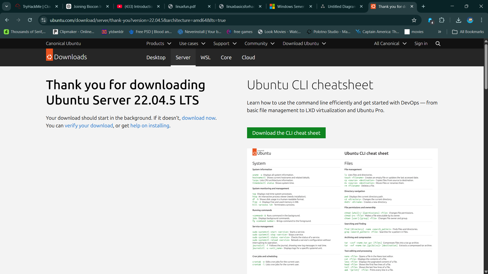
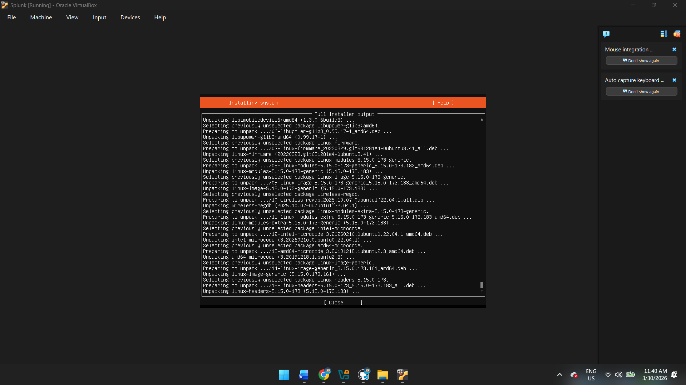
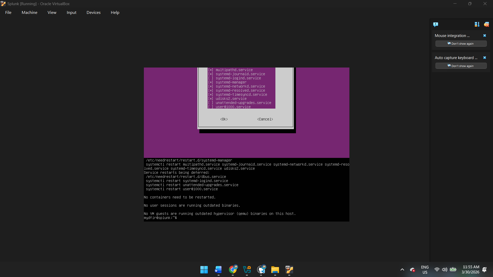
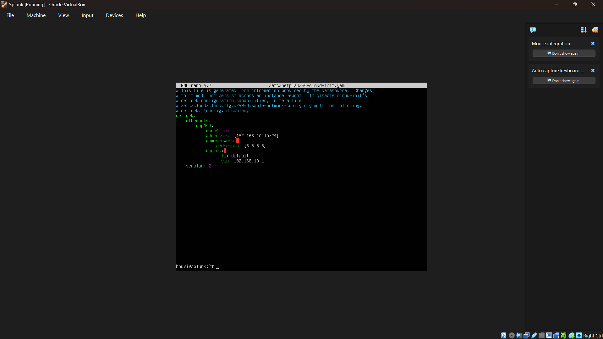
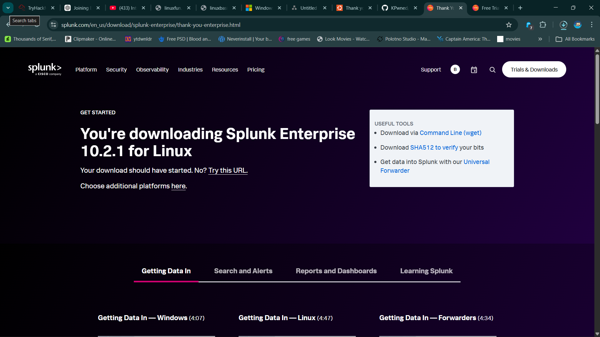
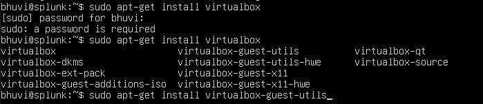
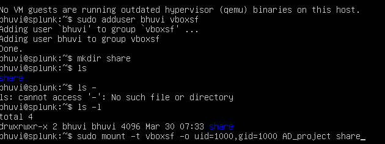
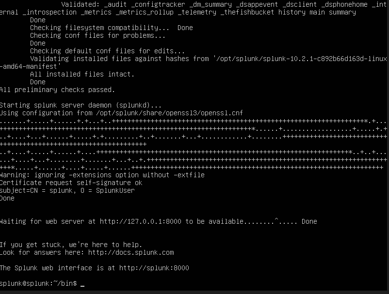

# 🔍 Splunk Implementation on Ubuntu Server

## 📌 Overview
This section describes the installation and configuration of Splunk Enterprise on an Ubuntu Server within a VirtualBox environment for centralized log monitoring.

---

## 🗺️ Project Topology
- Designed the project architecture using **draw.io**
- Included all machines:
  - Windows Server 2022 (Domain Controller)
  - Windows 10 (Client)
  - Ubuntu Server (Splunk)
  - Kali Linux (Attacker)



---

## 🖥️ Ubuntu Server Setup
- Downloaded Ubuntu Server ISO from the official website
- Created a new Virtual Machine in VirtualBox
- Installed Ubuntu Server




## 🌐 Network Configuration
- Connected the VM to custom NAT Network: **192.168.10.0/24**
- Edited network configuration using **Netplan** for proper connectivity



---

## 📦 Splunk Installation



### Step 1: Prepare Environment

```bash
sudo apt-get update
sudo apt-get install virtualbox-guest-additions-iso
```
Installed VirtualBox Guest Additions for better integration

### Step 2: Configure Shared Folder

Created a shared folder in VirtualBox

Added user to shared folder group:
```bash
sudo adduser bhuvi vboxsf
```
### Step 3: Mount Shared Folder
```bash
sudo mount -t vboxsf -o uid=1000,gid=1000 AD_project share
```
Mounted shared folder to access Splunk installer


### Step 4: Install Splunk Enterprise
```bash
sudo dpkg -i splunk*installer.deb
```
Installed Splunk using .deb package
⚙️ Splunk Configuration

### Step 5: Switch to Splunk User
```bash
sudo -u splunk bash
```
### Step 6: Start Splunk
```bash
sudo ./splunk start
```

Accepted license agreement
Created admin username and password

### Step 7: Enable Boot Start
```bash
sudo ./splunk enable boot-start -user splunk
```

Configured Splunk to start automatically on system boot

## Outcome
Successfully installed Splunk Enterprise on Ubuntu Server
Enabled centralized log monitoring capability
Prepared system for integration with Windows machines and log forwarding