# 🖥️ Target Machine Setup (Windows 10) & Log Forwarding

## 📌 Overview
This section describes the setup of the Windows 10 target machine, installation of Splunk Universal Forwarder, Sysmon configuration, and log forwarding to the Splunk server.

---

## 💻 Windows 10 Installation
- Downloaded Windows 10 ISO from Microsoft official website  
- Created and installed Windows 10 in VirtualBox  
- Renamed the PC for identification in the network  
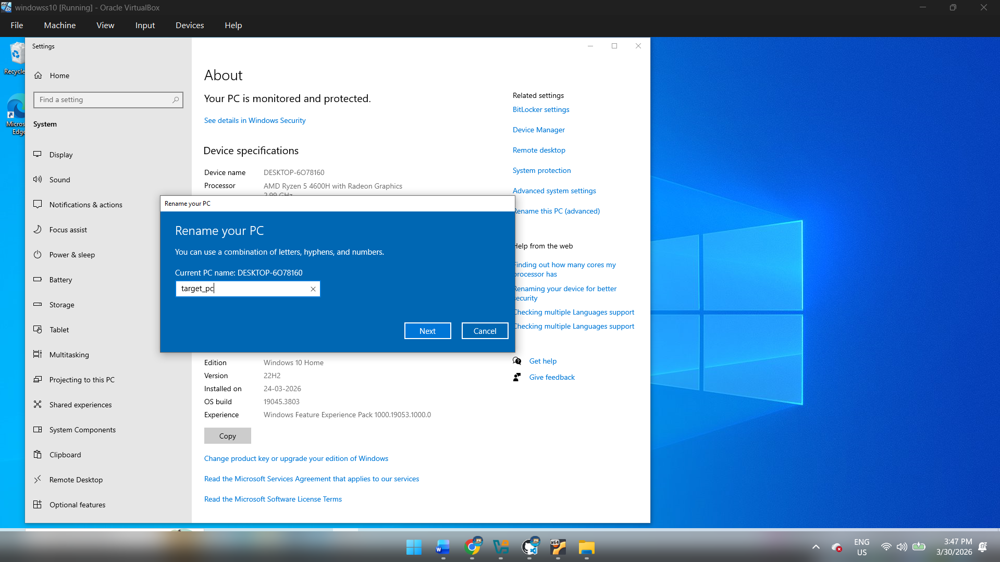
---

## Splunk Access Verification
- Verified connectivity to Splunk server from target machine:

```bash
https://192.168.10.10:8000
```
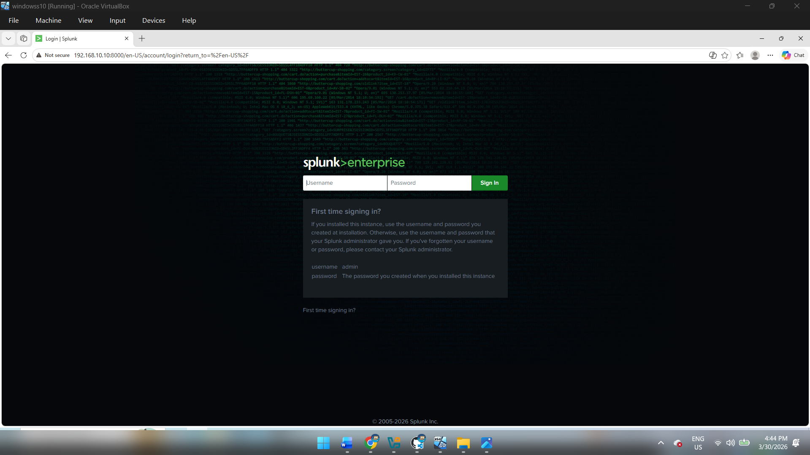
- Confirmed Splunk web interface is accessible  

---

## 📦 Splunk Universal Forwarder Installation
- Downloaded Splunk Universal Forwarder  
- Installed it on Windows 10 machine  
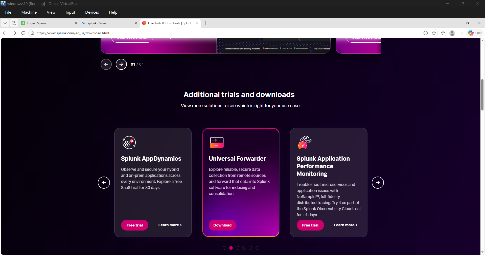
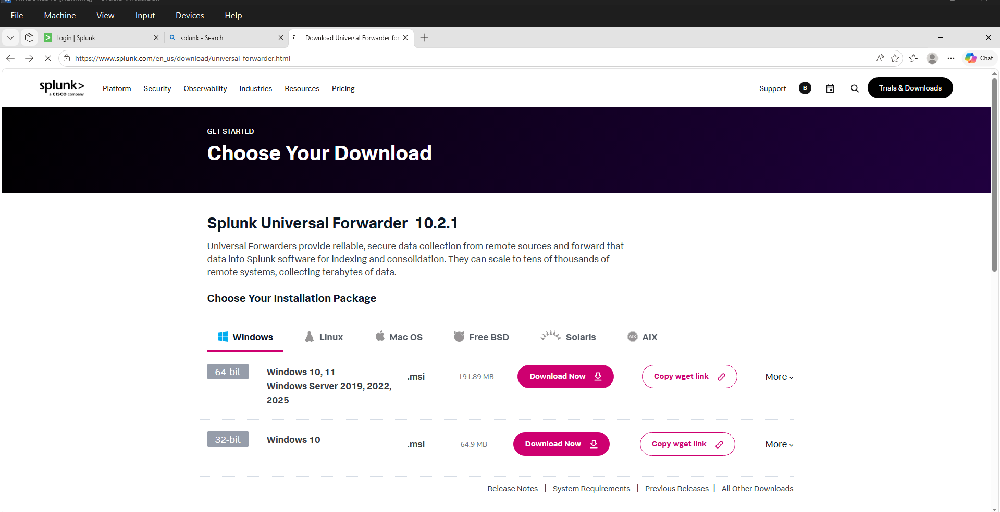
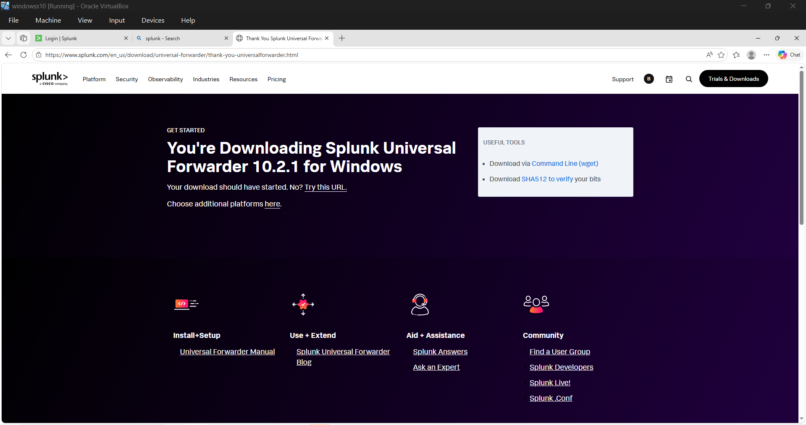
### Configuration:
- Set **Receiving Indexer IP**: `192.168.10.10` (Ubuntu Splunk Server)  
- Set **Port**: `9997`  
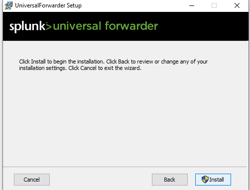
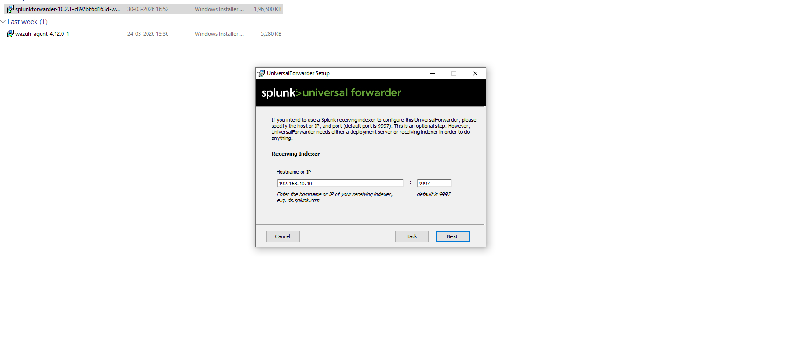
---

## 🔍 Sysmon Installation & Configuration

### Step 1: Download Sysmon
- Downloaded Sysmon from Microsoft Sysinternals:  
  https://learn.microsoft.com/en-us/sysinternals/downloads/sysmon  
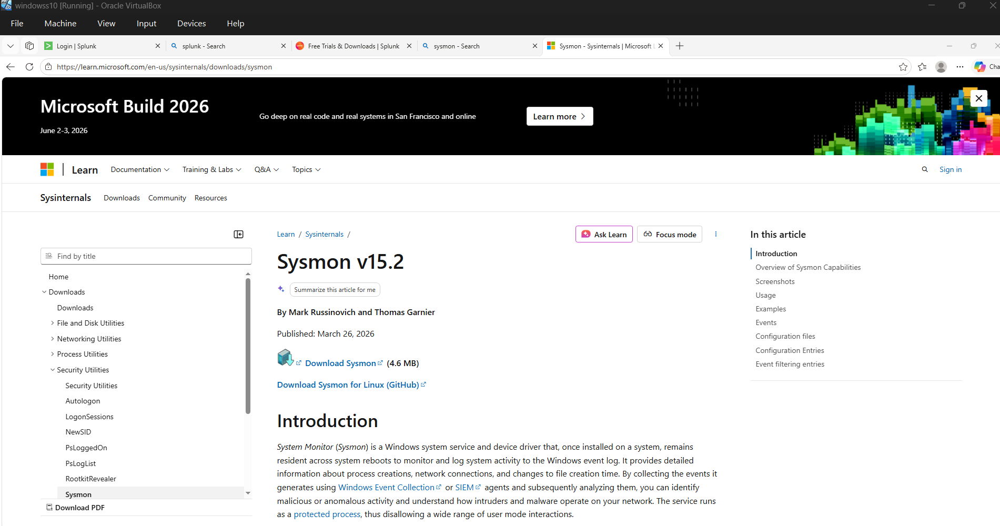
---

### Step 2: Sysmon Configuration File
- Used Sysmon modular configuration from GitHub:  
  https://github.com/olafhartong/sysmon-modular  
  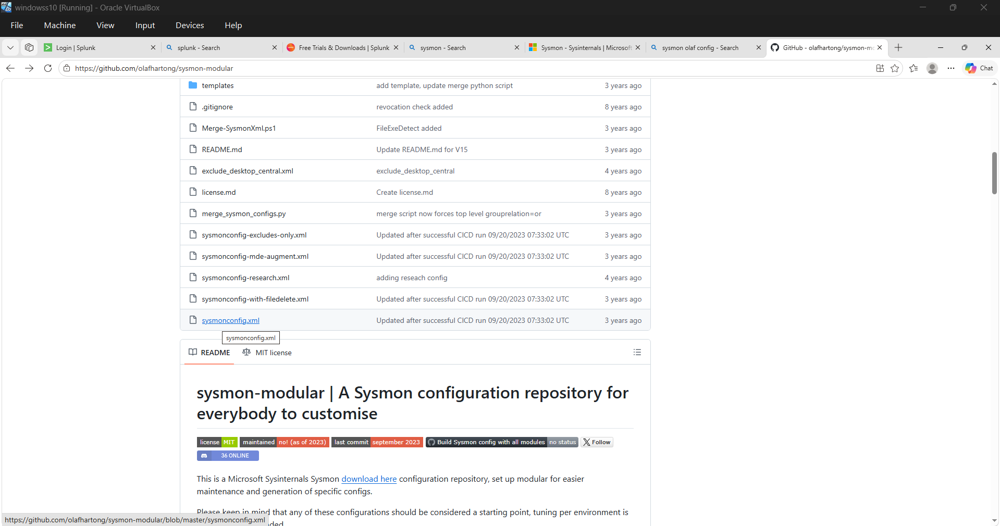


- Opened `sysmonconfig.xml` in raw format  
- Saved locally as: `sysmonconfig.xml`  

---

### Step 3: Install Sysmon
- Extracted Sysmon ZIP file  
- Opened PowerShell as Administrator  
- Navigated to Sysmon directory:
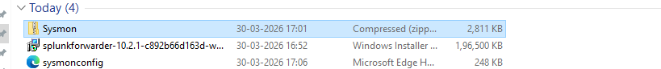
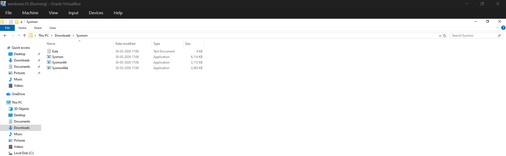

```powershell
cd <Sysmon_Path>
```

Installed Sysmon with configuration:

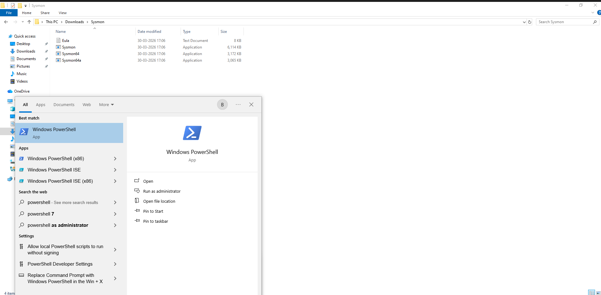

```bash
.\Sysmon64.exe -i ..\sysmonconfig.xml
```
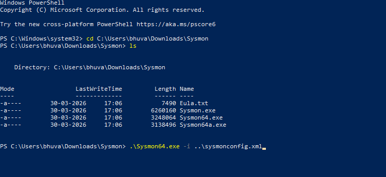
Accepted Sysmon license agreement

### Step 4: Configure inputs.conf
Edited inputs.conf file:
open notepad as administrater and copy the conf text given

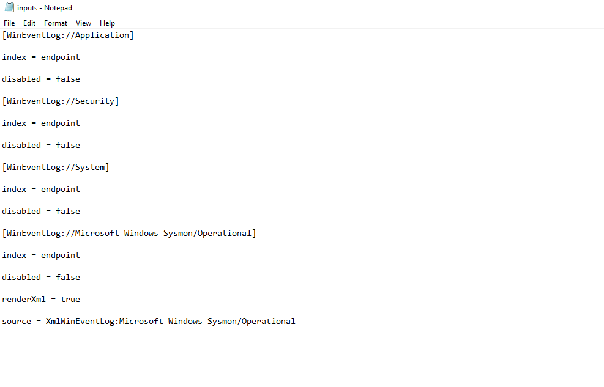

to copy inputs.conf follow the link
[inputs.conf](../configs/splunkconf.md)
and save it in 

```bash
C:\Program Files\SplunkUniversalForwarder\etc\system\local\inputs.conf
```
### Step 5: Configure Service Settings
Opened Services as Administrator
Located SplunkForwarder Service
Opened Properties → Log On tab
Selected Local System Account
Restarted the service

### Enable Receiving on Splunk Server
Opened Splunk Web Interface
Navigated to:
Settings → Forwarding and Receiving
Added new receiving port:
Port: 9997
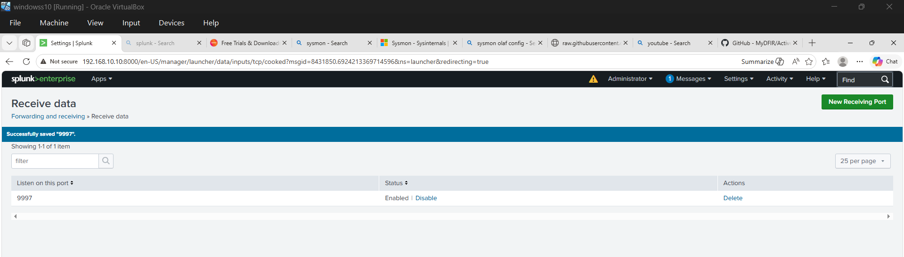
## Log Verification

### Step 6: Create Index
Created new index:
Name: endpoint
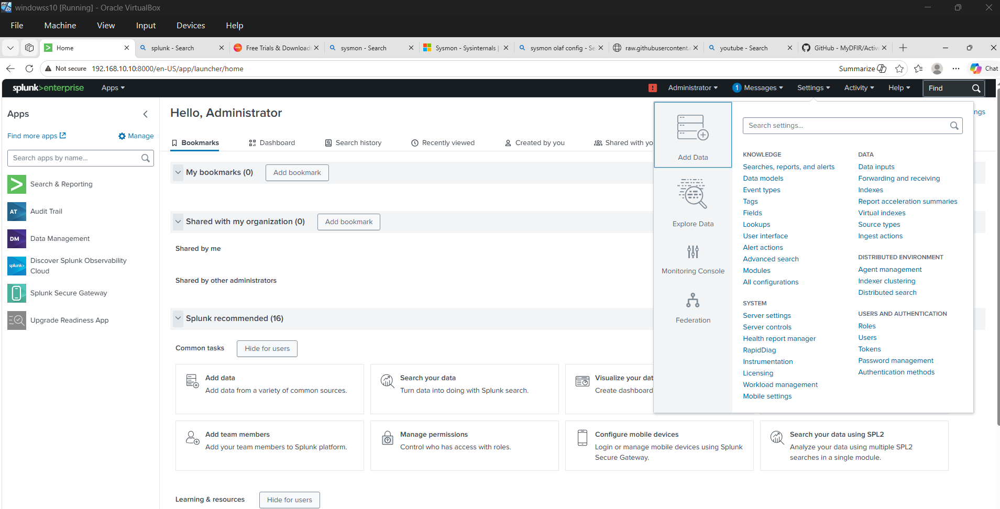
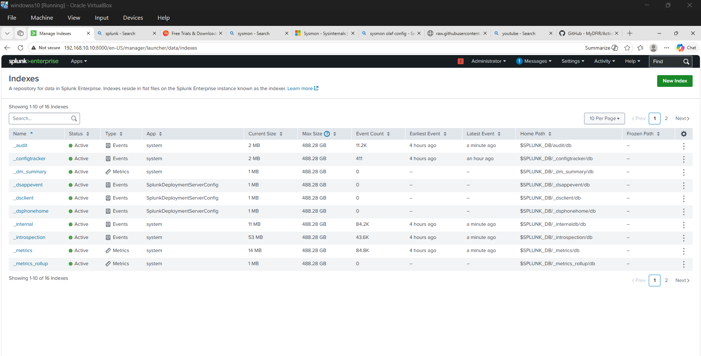
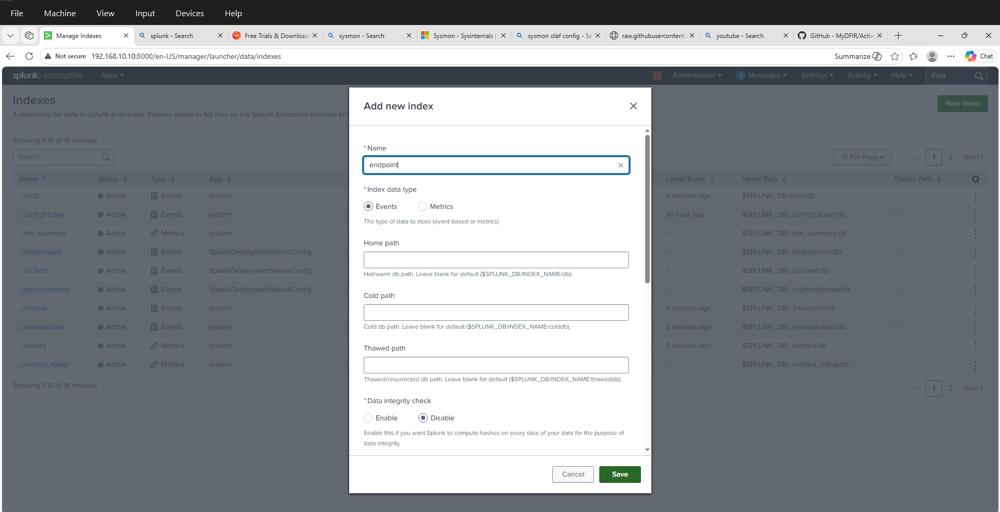
### Step 7: Search Logs
Opened Search & Reporting
Used query:
```bash
index=endpoint
```
Verified logs from target machine
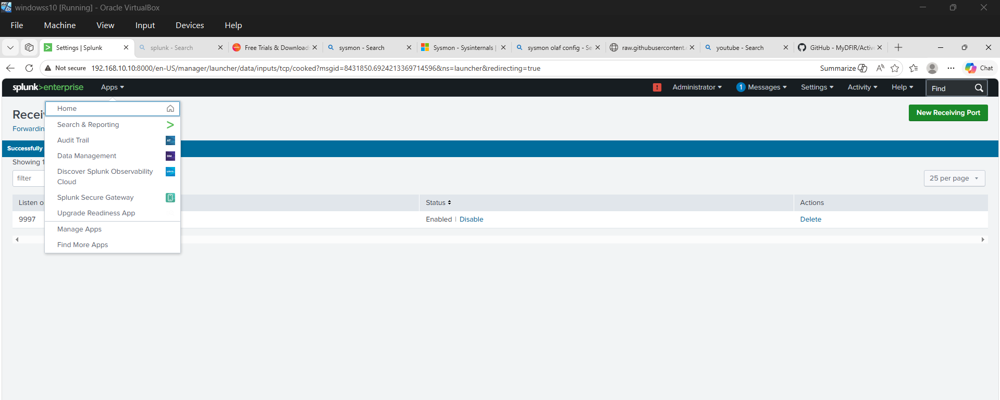
### Step 8: Host Verification
Checked Host field in Splunk
Confirmed Windows 10 machine appears:
Example: Target-PC

After configuring log forwarding:
Created a domain user in Active Directory
Logged into Windows 10 using domain credentials
Further monitoring and log analysis will be performed based on domain activity
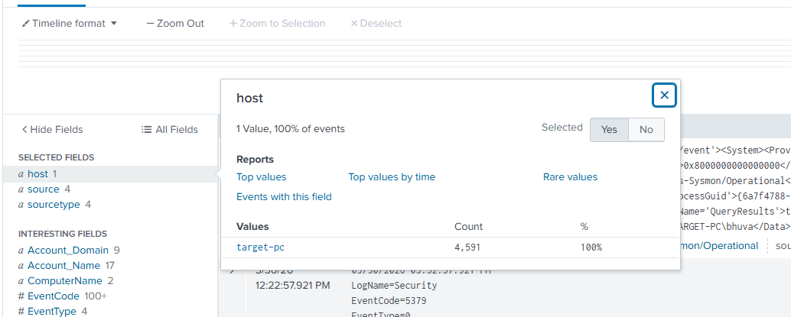
